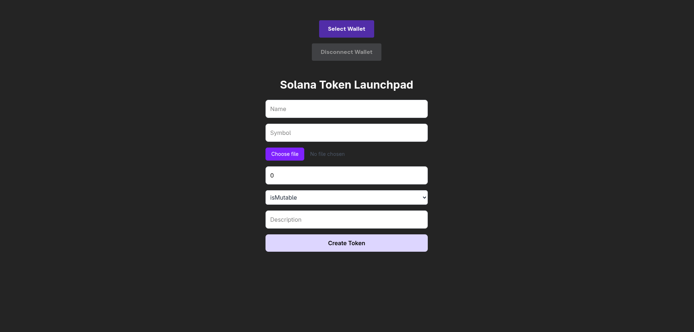
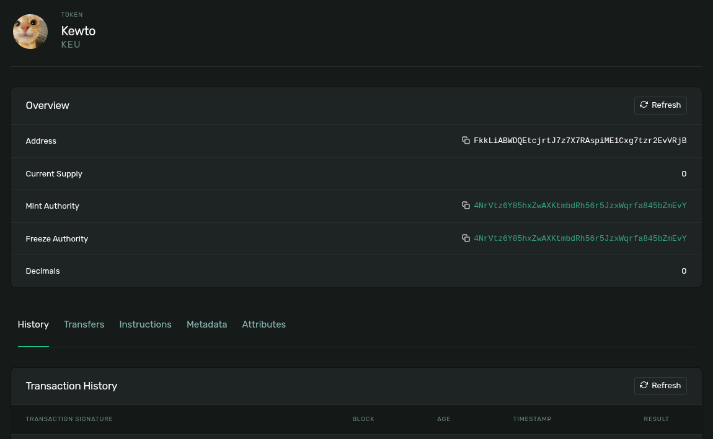

# Solana Token Launchpad

A React-based web application that allows users to create and launch custom tokens on the Solana blockchain (devnet).

## Features

- Create fungible tokens on Solana devnet
- Upload token images to IPFS via Pinata
- Customize token properties:
  - Name
  - Symbol
  - Decimals
  - Description
  - Token Image
  - Mutability settings
- Wallet integration using Solana Wallet Adapter
- UI with Tailwind CSS

## Screenshots

### Token Creation Form

### Created Token

